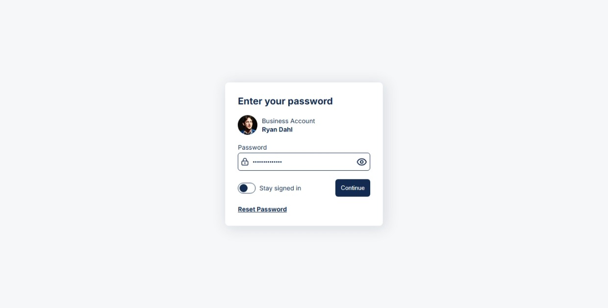

# Icodethis - Get in Touch component
This is a solution to the Icodethis - Get in Touch component

## Table of contents
- [Overview](#overview)
  - [Screenshot](#screenshot)
  - [Links](#links)
- [My process](#my-process)
  - [Built with](#built-with)
- [Author](#author)
- [Acknowledgments](#acknowledgments)

## Overview
This was a small project I wanted to try out for fun. It seemed simple at first, but there were some nice little challenges, like handling UI shifts, making it responsive, and adding a theme toggle. I learned a few things along the way and really enjoyed building it.

### Screenshot
 

### Links
- Solution URL: [github repo](https://github.com/zakaria-guenifi/get-in-touch-light-and-dark)
- Live Site URL: [live url](https://zakaria-guenifi.github.io/get-in-touch-light-and-dark/)

## My process
I started by exploring the project to figure out how I wanted to approach it. I built the HTML structure, styled everything with CSS, and wrapped it up by adding the theme toggle using a bit of JavaScript.

### Built with
- Semantic HTML5 markup
- Vanilla CSS
- Vanilla JS

## Author
- Website - [Zakaria Guenifi](https://www.guenifi.com)
- Frontend Mentor - [@zakaria-guenifi](https://www.frontendmentor.io/profile/zakaria-guenifi)

## Acknowledgments
I made sure to avoid the mistakes and accessibility issues I usually encounter.
